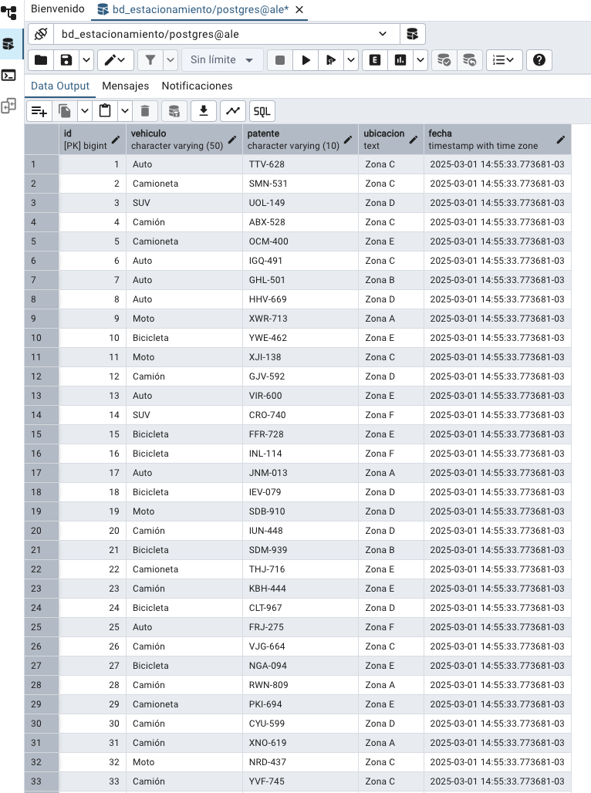

# 🚗 Estacionamiento Backend

Este es un backend desarrollado en Django para gestionar el registro de vehículos, patentes y ubicaciones en un estacionamiento. 🅿️

## 📌 Características
- ✅ API para registrar vehículos con su patente y ubicación.
- ✅ Base de datos en PostgreSQL.
- ✅ Administrador de Django para gestionar los registros manualmente.

## ⚙️ Instalación

### 🔧 Requisitos previos
- 🐍 Python 3.9+
- 🗄️ PostgreSQL
- 🛠️ Virtualenv (opcional pero recomendado)

### 🚀 Configuración del entorno
1. Clonar el repositorio:
   ```sh
   git clone https://github.com/alejandroponce00/parking_backend
   cd tu_repositorio
   ```
2. Crear y activar un entorno virtual:
   ```sh
   python -m venv venv
   source venv/bin/activate  # En macOS/Linux
   venv\Scripts\activate  # En Windows
   ```
3. Instalar las dependencias:
   ```sh
   pip install -r requirements.txt
   ```
4. Configurar la base de datos en `settings.py`:
   ```python
   DATABASES = {
       'default': {
           'ENGINE': 'django.db.backends.postgresql',
           'NAME': 'bd_estacionamiento',
           'USER': 'tu_usuario',
           'PASSWORD': 'tu_contraseña',
           'HOST': 'localhost',
           'PORT': '5432',
       }
   }
   ```

## 🏁 Uso

### 🔄 Migraciones
Ejecutar las migraciones para crear las tablas en la base de datos:
```sh
python manage.py migrate
```

### 👤 Crear un superusuario (opcional)
```sh
python manage.py createsuperuser
```

### ▶️ Iniciar el servidor
```sh
python manage.py runserver
```
El backend estará disponible en `http://127.0.0.1:8000/`

## 🖼️ Imagen de referencia


## 🤝 Contribuciones
Si deseas contribuir, abre un issue o un pull request con mejoras o correcciones. 🚀

## 📜 Licencia
📝 MIT

